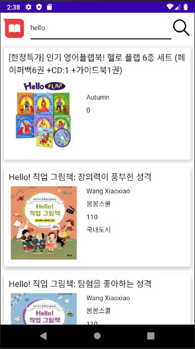

# BookSystem
인터파크 도서 관리 시스템
### 개발 기간
* UI 디자인
* 메인화면 구성
* AIP 연동
* 내부DB 연동

### 개발 언어
#### JAVA, ANDROID STUDIO

### 주요 화면별 기능
#### Intro

앱이 시작되면서 메인화면이 나오기 전까지 3초 동안 보일 화면   인터파크 그림 로고를 중앙에, 문구 로고를 하단에 배치하여 구성

#### Main

어플의 메인 화면 
책을 검색하거나 나의 도서목록으로 이동할 수 있음 
로고 이미지 클릭 시 메인화면으로 이동 
입력 창에 책 제목 검색 후 검색 버튼 클릭 시 검색 결과 화면으로 이동 
메인화면 버튼 클릭 시 메인화면으로 이동, 내 도서목록 이동 시 내 도서목록으로 이동 

#### Book Detail

#### Search

#### MyBookList

