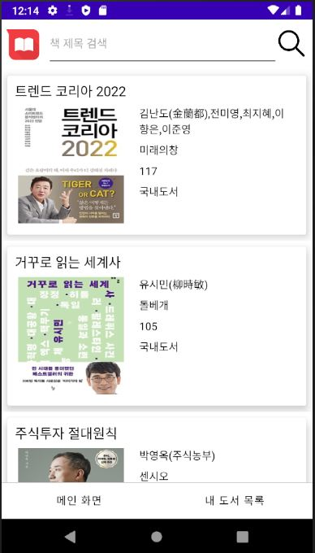
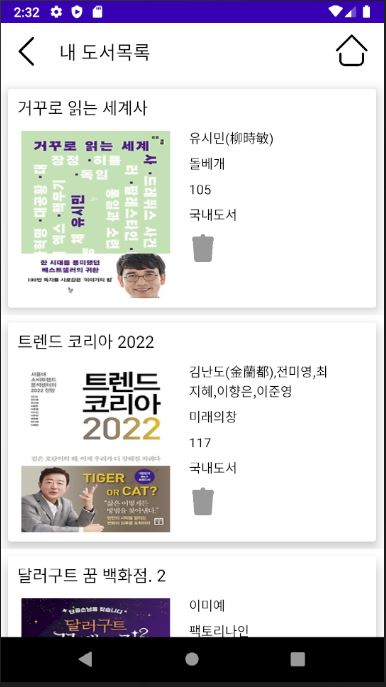

# BookSystem
인터파크 도서 관리 시스템
### 개발 기간
* UI 디자인
* 메인화면 구성
* AIP 연동
* 내부DB 연동

### 개발 언어
#### JAVA, ANDROID STUDIO

### 주요 화면별 기능
#### Intro

#### Main

#### Book Detail

#### Search

#### MyBookList

